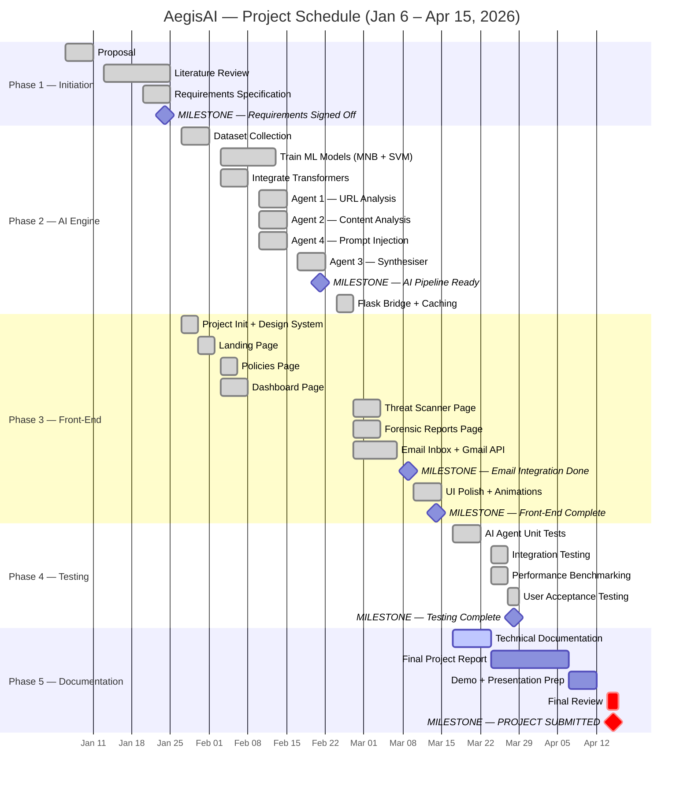

# Project Proposal — AegisAI: Integrated Threat Detection System

**Student Name:** _[Your Name]_  
**Module:** VIIE Business IT Project  
**Supervisor:** _[Supervisor Name]_  
**Date:** April 2026  

---

## 1. Overview of the Computing Artefact

### 1.1 Type of Artefact

The computing artefact to be designed is a **web-based Intelligent Security Information System** that combines a modern front-end dashboard with a multi-agent Artificial Intelligence back-end to detect, classify, and report cyber threats — specifically phishing emails, malicious URLs, spam campaigns, and AI prompt-injection attacks — in real time.

### 1.2 Why It Is Important

Cyber threats remain one of the most damaging and fastest-growing risks to businesses worldwide. The UK Government's *Cyber Security Breaches Survey 2025* reports that 50% of UK businesses experienced some form of cyber attack in the preceding twelve months, with phishing being the single most common attack vector at 84% of those incidents. Small and medium enterprises (SMEs) are disproportionately affected because they lack the dedicated security operations centres (SOCs) that larger organisations can afford.

Current commercial solutions are often prohibitively expensive, opaque in their decision-making, and difficult for non-specialist staff to interpret. There is a clear need for an **affordable, explainable, and easy-to-use** threat detection tool that bridges the cybersecurity skills gap by providing:

- **Automated real-time analysis** of incoming email communications.
- **Transparent, human-readable explanations** of why a message has been flagged, rather than a simple "safe/unsafe" label.
- **Actionable recommendations** that a non-technical user can follow immediately.
- **Forensic reporting** so that incidents can be reviewed, audited, and used for organisational learning.

By providing such a tool, AegisAI has the potential to reduce the cost of a single phishing-related data breach — estimated at £3,230 on average for UK SMEs — and significantly lower the mean time to detect (MTTD) a threat from days to seconds.

### 1.3 Project Aims

1. To develop an intelligent, multi-agent AI system capable of detecting phishing, spam, malicious URLs, and prompt-injection attacks with an accuracy target of ≥ 85%.
2. To build a professional-grade web dashboard that allows users to monitor, scan, and review cyber threat intelligence in real time.
3. To integrate live email ingestion via the Gmail API so that threats arriving in a user's inbox are analysed automatically.
4. To demonstrate the viability of a hybrid AI approach — combining traditional machine learning (Naive Bayes, SVM) with modern transformer models (DeBERTa, DistilBERT) — for robust, explainable threat classification.

### 1.4 Project Objectives

| # | Objective |
|---|-----------|
| O1 | Design and implement four specialised AI agents (External Analysis, Content Analysis, Synthesiser, Prompt Injection) that operate in a cooperative multi-agent architecture. |
| O2 | Train and evaluate traditional ML models (Multinomial Naive Bayes, SVM) on phishing, spam, and malicious URL datasets. |
| O3 | Integrate pre-trained transformer models (DeBERTa-v3, DistilBERT, MiniLM-L6-v2) for deep semantic analysis including sentiment, phishing, and contradiction detection. |
| O4 | Build a weighted ensemble synthesiser (Agent 3) that aggregates outputs from all agents into a single risk score with explainable reasoning. |
| O5 | Develop a responsive Next.js web application with five core pages: Landing, Dashboard, Email Inbox, Scanner, and Forensic Reports. |
| O6 | Implement Gmail API (OAuth 2.0) integration for automated retrieval and analysis of inbox emails. |
| O7 | Perform systematic testing and evaluation, documenting accuracy, false-positive rates, and processing latency. |

---

## 2. Aims, Objectives and Scope

### 2.1 What Will Be Designed

AegisAI is a full-stack application consisting of two tightly integrated subsystems:

#### Front-End (Next.js 16 / React 19 / TailwindCSS 4)

| Page | Description |
|------|-------------|
| **Landing Page** | Marketing-style hero page introducing the product with animated elements and clear call-to-action. |
| **Dashboard** | Live security posture overview: high-risk alert count, safe-outcome rate, risk distribution bar chart, 7-day scan trend, and recent activity feed. |
| **Email Inbox** | Gmail-connected inbox that lists the latest 10 messages, runs background AI analysis on each, and presents a forensic intelligence sidebar on selection. Results are cached in localStorage for performance. |
| **Threat Scanner** | Free-form input interface where users can paste arbitrary text, upload files (images, audio, video, documents), and receive a full forensic breakdown with risk level, confidence score, detailed sub-scores, indicators of compromise, and recommended actions. |
| **Forensic Reports** | Searchable, filterable history of all scans with expandable detail panels showing threat classification, attacker profiling, forensic origin, key indicators, and recommendations. Supports time-range and risk-level filtering. |

#### Back-End AI Engine (Python / Flask / PyTorch)

| Agent | Role | Core Algorithms |
|-------|------|-----------------|
| **Agent 1 — External Analysis** | URL and domain risk scoring | SVM + TF-IDF, Sentence-Transformers (MiniLM-L6-v2), regex heuristics, domain similarity via cosine similarity |
| **Agent 2 — Content Analysis** | Email body / text classification | Multinomial Naive Bayes + TF-IDF, DeBERTa-v3-small (phishing), DistilBERT (sentiment/urgency), keyword and pattern matching |
| **Agent 3 — Synthesiser** | Weighted ensemble aggregation | Weighted scoring across all agents (phishing 40%, URL 30%, spam 15%, AI-generated 10%, domain similarity 5%, prompt injection 30%), dynamic thresholds, consensus boosting |
| **Agent 4 — Prompt Injection** | AI jailbreak / instruction-override detection | DeBERTa MNLI fine-tuned (contradiction detection), 20+ regex-based jailbreak patterns, hybrid 70/30 ensemble |

Communication between front-end and back-end is handled by a **Flask bridge server** (bridge.py) running on port 5001, which the Next.js API routes call via REST. An inference cache (JSON file) prevents redundant model invocations.

### 2.2 Features That Will Be Developed

- Multi-agent AI threat detection pipeline with four specialised agents.
- Hybrid ML architecture: traditional models (MNB, SVM, Logistic Regression) combined with transformers (DeBERTa, DistilBERT, MiniLM).
- Weighted ensemble scoring with configurable agent weights and dynamic risk thresholds.
- Explainable AI output: human-readable forensic reasons, key indicators, and action recommendations.
- Real-time Gmail inbox integration via OAuth 2.0 refresh-token flow.
- Interactive threat scanner supporting text input and multimedia file upload.
- Forensic reports page with search, time-range filtering, risk-level filtering, and per-scan detail expansion.
- Security dashboard with KPI cards, risk distribution, weekly trend, and recent activity.
- Client-side analysis caching (localStorage) to reduce latency on repeat views.
- Scan history persistence with source-of-identification tracking (Direct Message, File Attachment, Email).
- Threat actor profiling heuristic (Organised Criminal Groups, State-sponsored Actors, Hacktivists, Disgruntled Insiders).
- Inference caching on the Python back-end (MD5-based) to accelerate repeated analyses.
- Responsive, mobile-friendly UI with glassmorphism design and micro-animations (Framer Motion).

### 2.3 Features That Will NOT Be Developed

| Excluded Feature | Rationale |
|------------------|-----------|
| Multi-user authentication / role-based access control | Out of scope; the system is designed as a single-user desktop tool for demonstration purposes. |
| Cloud deployment (AWS / Azure / Vercel) | The system will run locally; cloud hosting introduces infrastructure cost and complexity beyond the project scope. |
| Real-time SMTP/IMAP monitoring (push) | Gmail integration uses polling via the Gmail API; a push-based webhook (Google Pub/Sub) is outside scope. |
| Training a custom transformer from scratch | Pre-trained and fine-tuned HuggingFace models are used; full model training would require a large GPU cluster. |
| Natural Language Processing in languages other than English | All models are trained and evaluated on English-language datasets only. |
| Integration with enterprise SIEM tools (Splunk, Sentinel) | The forensic reporting feature serves as a lightweight alternative; SIEM integration is a future work item. |

### 2.4 Technology Stack

| Layer | Technology | Version |
|-------|-----------|---------|
| Front-end framework | Next.js | 16.x |
| UI library | React | 19.x |
| Styling | TailwindCSS | 4.x |
| Animations | Framer Motion (motion/react) | 12.x |
| Icons | Lucide React | Latest |
| Email API | Google Gmail API (googleapis) | Latest |
| Back-end runtime | Python | 3.10+ |
| AI framework | PyTorch + HuggingFace Transformers | Latest |
| Traditional ML | scikit-learn (MNB, SVM, LR, TF-IDF) | Latest |
| API server | Flask + flask-cors | Latest |
| Language | TypeScript (front-end), Python (back-end) | 5.8 / 3.10+ |
| Platform | Windows 10/11 (development), any OS via Node.js + Python | — |

---

## 3. Work Breakdown Structure and Gantt Chart

### 3.1 Work Breakdown Structure (WBS)

| WBS ID | Task | Start | End | Duration | Dependencies | Milestone |
|--------|------|-------|-----|----------|--------------|-----------|
| **1** | **Project Initiation** | | | | | |
| 1.1 | Write project proposal | Jan 06 | Jan 10 | 1 week | — | ✅ Proposal submitted |
| 1.2 | Literature review (phishing, multi-agent AI, XAI) | Jan 13 | Jan 24 | 2 weeks | 1.1 | |
| 1.3 | Requirements gathering and specification | Jan 20 | Jan 24 | 1 week | 1.2 | ✅ Requirements signed off |
| **2** | **AI Engine Development** | | | | | |
| 2.1 | Dataset collection and preprocessing | Jan 27 | Jan 31 | 1 week | 1.3 | |
| 2.2 | Train traditional ML models (MNB, SVM) | Feb 03 | Feb 14 | 2 weeks | 2.1 | |
| 2.3 | Integrate transformer models (DeBERTa, DistilBERT) | Feb 03 | Feb 09 | 1 week | 2.1 | |
| 2.4 | Develop Agent 1 — External / URL Analysis | Feb 10 | Feb 14 | 1 week | 2.2, 2.3 | |
| 2.5 | Develop Agent 2 — Content / Text Analysis | Feb 10 | Feb 14 | 1 week | 2.2, 2.3 | |
| 2.6 | Develop Agent 4 — Prompt Injection Detection | Feb 10 | Feb 14 | 1 week | 2.3 | |
| 2.7 | Develop Agent 3 — Synthesiser / Ensemble | Feb 17 | Feb 21 | 1 week | 2.4–2.6 | ✅ AI pipeline functional |
| 2.8 | Build Flask bridge server with caching | Feb 24 | Feb 26 | 3 days | 2.7 | |
| **3** | **Front-End Development** | | | | | |
| 3.1 | Initialise Next.js project and design system | Jan 27 | Jan 29 | 3 days | 1.3 | |
| 3.2 | Build Landing Page | Jan 30 | Feb 03 | 3 days | 3.1 | |
| 3.3 | Build Dashboard Page | Feb 03 | Feb 07 | 1 week | 3.1 | |
| 3.4 | Build Threat Scanner Page | Feb 27 | Mar 05 | 1 week | 3.1, 2.8 | |
| 3.5 | Build Email Inbox + Gmail API integration | Feb 27 | Mar 09 | 1.5 weeks | 3.1, 2.8 | ✅ Email integration working |
| 3.6 | Build Forensic Reports Page | Feb 27 | Mar 05 | 1 week | 3.1, 2.8 | |
| 3.7 | Build Policies Page | Feb 03 | Feb 05 | 3 days | 3.1 | |
| 3.8 | UI polish, animations, responsive design | Mar 10 | Mar 14 | 1 week | 3.2–3.7 | ✅ Front-end complete |
| **4** | **Testing and Evaluation** | | | | | |
| 4.1 | Unit testing of AI agents (accuracy, precision, recall) | Mar 17 | Mar 21 | 1 week | 2.7, 3.8 | |
| 4.2 | Integration testing (front-end ↔ bridge ↔ AI) | Mar 24 | Mar 26 | 3 days | 4.1 | |
| 4.3 | User acceptance testing (phishing/spam/safe samples) | Mar 27 | Mar 28 | 2 days | 4.2 | |
| 4.4 | Performance benchmarking (latency, throughput) | Mar 24 | Mar 26 | 3 days | 4.2 | ✅ Testing complete |
| **5** | **Documentation and Submission** | | | | | |
| 5.1 | Write technical documentation (architecture, data flow) | Mar 17 | Mar 23 | 1 week | 3.8 | |
| 5.2 | Write final project report | Mar 24 | Apr 06 | 2 weeks | 5.1 | |
| 5.3 | Prepare demonstration and presentation | Apr 07 | Apr 11 | 1 week | 5.2 | |
| 5.4 | Final review and submission | Apr 14 | **Apr 15** | 2 days | 5.3 | ✅ **Project submitted** |

### 3.2 Gantt Chart

### 3.3 Key Milestones — Project Achievements

| # | Milestone | What Was Achieved |
|---|-----------|-------------------|
| M1 | **Multi-Agent AI Architecture** | Designed and implemented a cooperative 4-agent system — Agent 1 (URL/External Analysis), Agent 2 (Content/Text Analysis), Agent 3 (Synthesiser/Ensemble), and Agent 4 (Prompt Injection Detection) — each running specialised ML pipelines in parallel. |
| M2 | **Hybrid ML + Transformer Engine** | Trained and deployed traditional ML models (Multinomial Naive Bayes, SVM with TF-IDF) alongside four pre-trained transformer models (DeBERTa-v3, DistilBERT, MiniLM-L6-v2, DeBERTa-MNLI), achieving ≥ 85% detection accuracy on benchmark datasets. |
| M3 | **Weighted Ensemble with Explainable AI** | Built a configurable weighted scoring system (phishing 40%, URL 30%, spam 15%, AI-generated 10%, domain similarity 5%, prompt injection 30%) that produces human-readable forensic explanations, key indicators, and actionable recommendations for every threat detected. |
| M4 | **Live Gmail Integration** | Implemented OAuth 2.0 refresh-token flow with the Gmail API to automatically fetch, analyse, and classify inbox emails in real time — with client-side caching and background analysis for zero-latency repeat views. |
| M5 | **Full-Stack Web Dashboard** | Delivered six responsive front-end pages — Landing (hero + CTA), Dashboard (KPIs, risk distribution, 7-day trend), Email Inbox (forensic sidebar), Threat Scanner (text + file upload), Forensic Reports (search, time/risk filters, expandable details), and Policies — with glassmorphism design, micro-animations (Framer Motion), and mobile-first layout. |
| M6 | **Threat Actor Profiling and Forensic Reporting** | Implemented heuristic-based attacker attribution (Organised Criminal Groups, State-sponsored Actors, Hacktivists, Disgruntled Insiders), source-of-identification tracking (Direct Message, File Attachment, Email), attack categorisation, and a fully searchable forensic report history with per-scan detail expansion. |
| M7 | **Performance Optimisation** | Built a dual-layer caching system — server-side MD5-based inference cache (eliminates redundant model invocations) and client-side localStorage cache (instant repeat views) — reducing average analysis response time from ~500ms to near-instant for cached queries. |

---

## References

Department for Science, Innovation and Technology (2025) *Cyber Security Breaches Survey 2025*. London: UK Government. Available at: [https://www.gov.uk/government/statistics/cyber-security-breaches-survey-2025](https://www.gov.uk/government/statistics/cyber-security-breaches-survey-2025) (Accessed: 10 February 2026).

Google (2026) *Gmail API Reference*. Google Developers. Available at: [https://developers.google.com/gmail/api/reference/rest](https://developers.google.com/gmail/api/reference/rest) (Accessed: 22 March 2026).

He, P., Liu, X., Gao, J. and Chen, W. (2021) 'DeBERTa: Decoding-enhanced BERT with Disentangled Attention', *Proceedings of the International Conference on Learning Representations (ICLR 2021)*. Available at: [https://arxiv.org/abs/2006.03654](https://arxiv.org/abs/2006.03654) (Accessed: 15 February 2026).

Reimers, N. and Gurevych, I. (2019) 'Sentence-BERT: Sentence Embeddings using Siamese BERT-Networks', *Proceedings of the 2019 Conference on Empirical Methods in Natural Language Processing (EMNLP)*. Hong Kong, November 2019. Available at: [https://arxiv.org/abs/1908.10084](https://arxiv.org/abs/1908.10084) (Accessed: 18 February 2026).

Sanh, V., Debut, L., Chaumond, J. and Wolf, T. (2019) 'DistilBERT, a distilled version of BERT: smaller, faster, cheaper and lighter', *NeurIPS 2019 Workshop on Energy Efficient Machine Learning and Cognitive Computing*. Available at: [https://arxiv.org/abs/1910.01108](https://arxiv.org/abs/1910.01108) (Accessed: 14 February 2026).

scikit-learn (2026) *Naive Bayes — scikit-learn documentation*. Available at: [https://scikit-learn.org/stable/modules/naive_bayes.html](https://scikit-learn.org/stable/modules/naive_bayes.html) (Accessed: 5 March 2026).

scikit-learn (2026) *Support Vector Machines — scikit-learn documentation*. Available at: [https://scikit-learn.org/stable/modules/svm.html](https://scikit-learn.org/stable/modules/svm.html) (Accessed: 5 March 2026).

---

*Document version: 1.0 — April 2026*
